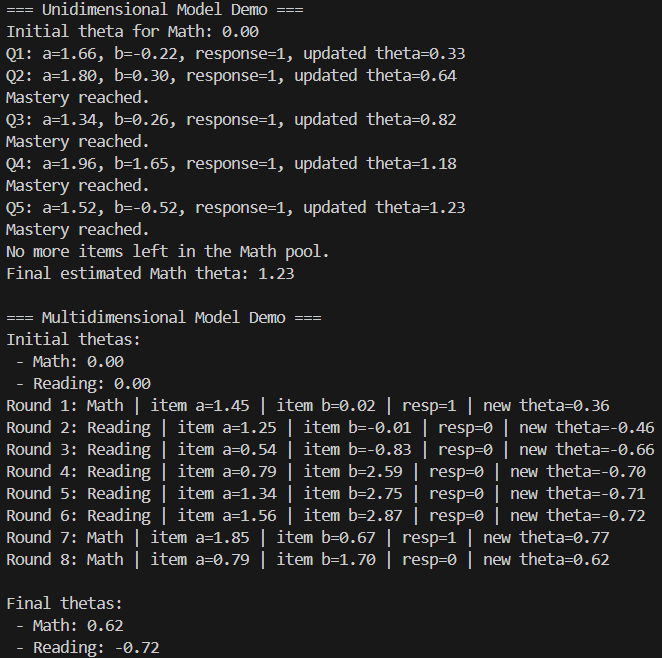

# Models README

## UnidimensionalModel

This class provides a simple wrapper around [`adaptivetesting`](https://github.com/condecon/adaptivetesting)'s 'TestAssembler' class for managing a 3PL unidimensional IRT model. 
Each instance of 'UnidimensionalModel' tracks a single skill or concept for a student, keeping an estimate of their current ability (theta) and manages the adaptive testing process for this skill.

### UnidimensionalModel Methods

- get_theta(): Provides the current estimated ability value.
- get_skill(): Provides the skill this model is tracking.
- get_responses(): Provides a list of responses to questions from this skill (1 for correct, 0 for incorrect).
- get_next_item(): Provides the TestItem object associated with the next question that should be asked in the adaptive test. The item selection strategy can be modified by providing an item_selector parameter during the creation of this object. By default, will choose the question that should give the most information for estimating ability. If no items are left, it returns None. 
- record_response(response: int, item: TestItem): Records a correct/incorrect response to a particular item. This method will update the current theta estimate after recording the response. 

## MultidimensionalModel

This class is designed to represent one test for a particular student. It tracks multiple theta values of different skills through the models attribute, which holds multiple 'UnidimensionalModel' objects, all representing one skill or concept. 
'MultidimensionalModel' objects will choose the next question to administer to the student based on which skill currently has the lowest theta value and still has items left to ask. This is something that could (and should) be experimented with in the future. 

### MultidimensionalModel Methods 

- add_model(skill: str, item_pool: ItemPool, initial_theta: float = 0.0, ability_estimator: Type[IEstimator] = BayesModal, estimator_args: dict[str, Any] | None = None, item_selector: ItemSelectionStrategy = maximum_information_criterion, item_selector_args: dict[str, Any] | None = None): Creates a new 'UnidimensionalModel' object set up to track the specified skill. 
- get_theta(skill: str): Provides the current estimated ability value of the specified skill. 
- record_response(skill: str, response: int, item: TestItem): Records a correct/incorrect response to a particular item. This method will update the current theta estimate of the specified skill after recording the response.
- get_next_item(): Provides the TestItem object associated with the next question that should be asked in the adaptive test. Currently, it will get the next question from the model with the lowest estimated ability value.

## Examples

There is a provided example.py file which will create multiple UnidimensionalModel objects and a MultidimensionalModel object. The example demonstrates some core functionality: getting items, updating theta, reaching mastery, exhausting the number of items in a class, and choosing between different models to get questions from in the MultidimensionalModel class. Below is some example output: 

